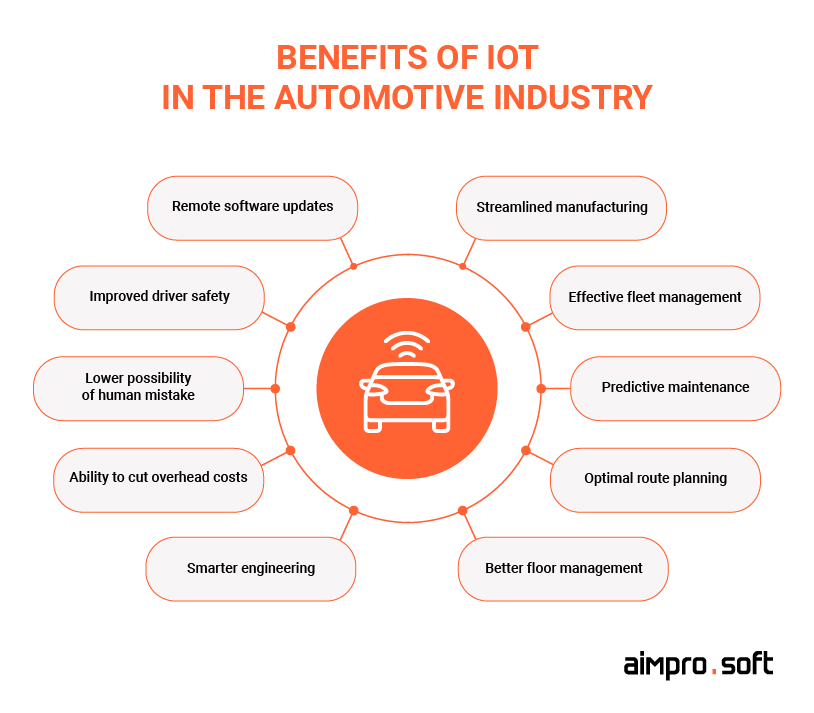
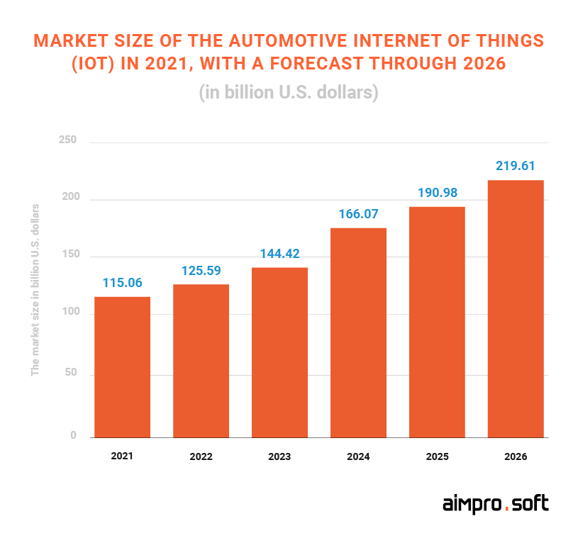
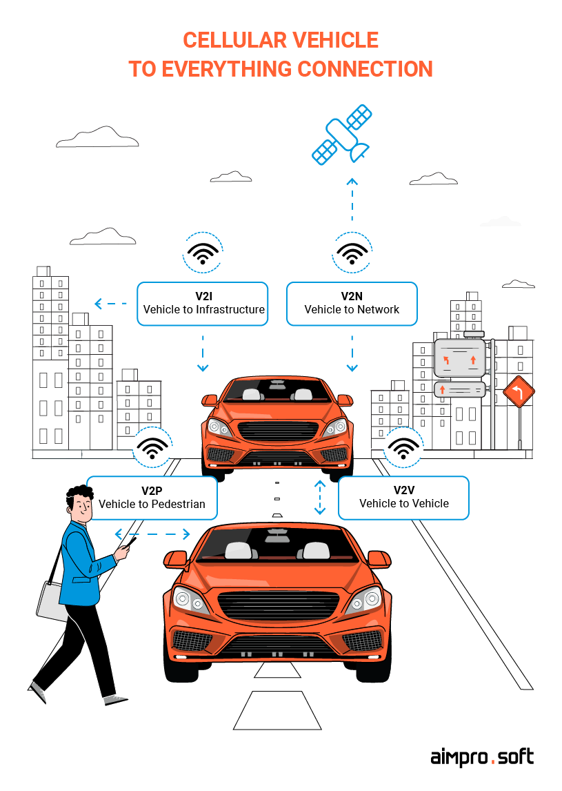

# IoT in the Automotive Industry: Use cases and Value

## Introduction

The Internet of Things (IoT) is revolutionizing the automotive industry by transforming vehicles into smart, connected devices. This README provides an overview of key use cases for IoT in the automotive industry and explains the value chain that supports these innovations.

## Market Size

## Use Cases

### 1. Connected Cars and Vehicle Telematics

- **Description:** IoT enables vehicles to communicate with each other (V2V), infrastructure (V2I), and the cloud. This connectivity supports telematics services like real-time navigation, traffic updates, and vehicle diagnostics.

**V2V** 

— exchanges data about a vehicle’s place, speed, and dynamics and also helps prevent collisions; 

**V2I** 

— exchanges data between a vehicle and road infrastructure (traffic lights, lane markings, and risk booths), and enables drivers to save their time by managing traffic and overflows or ranges; 

**V2P** 

— allows a pedestrian to connect with C-V2X via the mobile app, where they can check information about city transportation or taxis.

- **Value:** Enhances safety through collision avoidance systems, improves driving experiences with real-time updates, and reduces costs with predictive maintenance.

### 2. Autonomous Driving
- **Description:** IoT sensors, cameras, and LIDAR systems collect data to enable self-driving capabilities, allowing vehicles to navigate and make decisions autonomously.
- **Value:** Minimizes accidents due to human error, increases mobility options, and optimizes traffic flow.

### 3. Fleet Management
- **Description:** IoT devices monitor the location, speed, fuel consumption, and engine health of fleet vehicles, enabling remote management and optimization.
- **Value:** Enhances operational efficiency, reduces fuel costs, and ensures better compliance with regulations.

### 4. In-Vehicle Infotainment
- **Description:** IoT enables personalized and connected entertainment experiences within the vehicle, integrating music streaming, hands-free communication, and navigation systems.
- **Value:** Improves passenger experience and customer satisfaction while opening new revenue streams for automakers.

### 5. Smart Parking Solutions
- **Description:** IoT-enabled parking systems allow drivers to find available parking spaces in real-time, reserve spots, and make payments via mobile apps.
- **Value:** Reduces traffic congestion, saves time, and enhances urban mobility.

### 6. Remote Vehicle Control
- **Description:** IoT allows car owners to remotely control and monitor their vehicles through mobile apps, including functions like locking/unlocking doors and checking fuel levels.
- **Value:** Increases convenience, enhances vehicle security, and boosts user engagement.

## Value Chain of IoT in the Automotive Industry

### 1. Sensors and Devices
- **Role:** Collect data on various parameters such as speed, temperature, location, and environment.
- **Contribution:** Enable real-time data collection crucial for connected and autonomous vehicles.

### 2. Connectivity
- **Role:** Utilize technologies like 4G/5G, Wi-Fi, and Bluetooth to transmit data between vehicles, infrastructure, and the cloud.
- **Contribution:** Ensure reliable and fast communication for real-time decision-making and remote functionalities.

### 3. Data Processing and Analytics
- **Role:** Process and analyze data using edge computing and cloud platforms, employing AI and machine learning algorithms.
- **Contribution:** Provide actionable insights for autonomous driving, predictive maintenance, and personalized user experiences.

### 4. Applications and Services
- **Role:** End-user applications such as mobile apps for remote control, fleet management systems, and in-vehicle infotainment platforms.
- **Contribution:** Directly enhance user experience, operational efficiency, and create new revenue streams for manufacturers and service providers.

### 5. Security and Compliance
- **Role:** Ensure data privacy and protection through encryption, authentication, and compliance with regulations like GDPR.
- **Contribution:** Build consumer trust, protect sensitive data, and ensure legal compliance.

### 6. Integration and Ecosystem
- **Role:** Integrate IoT solutions with other automotive systems and collaborate with partners across the ecosystem, including suppliers and technology providers.
- **Contribution:** Create a seamless automotive experience, foster innovation, and enhance scalability of IoT solutions.

### sources
- https://www.aimprosoft.com/blog/automotive-iot-use-cases-for-cars-vehicles/#the-most-common-iot-use-cases-in-the-automotive-industry

